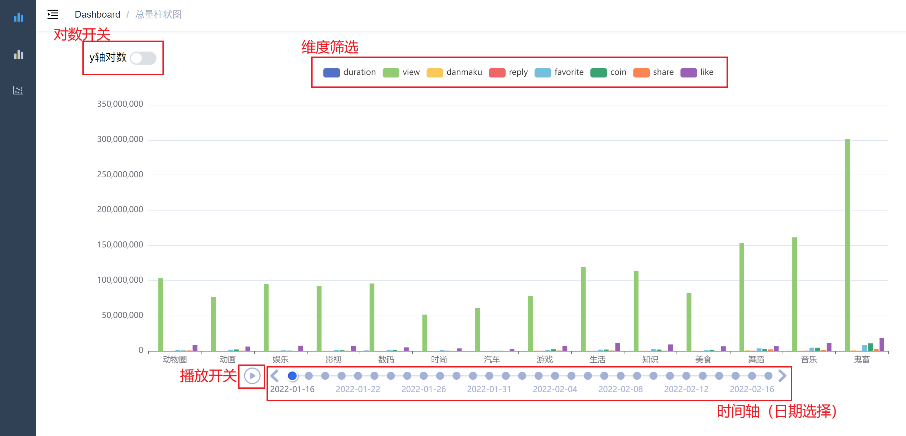
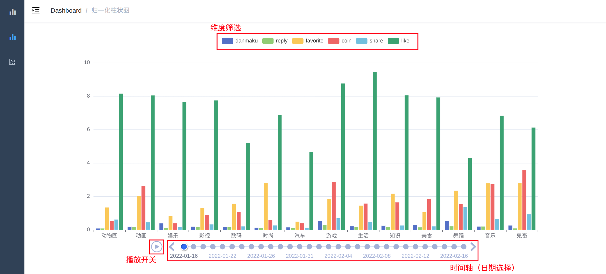
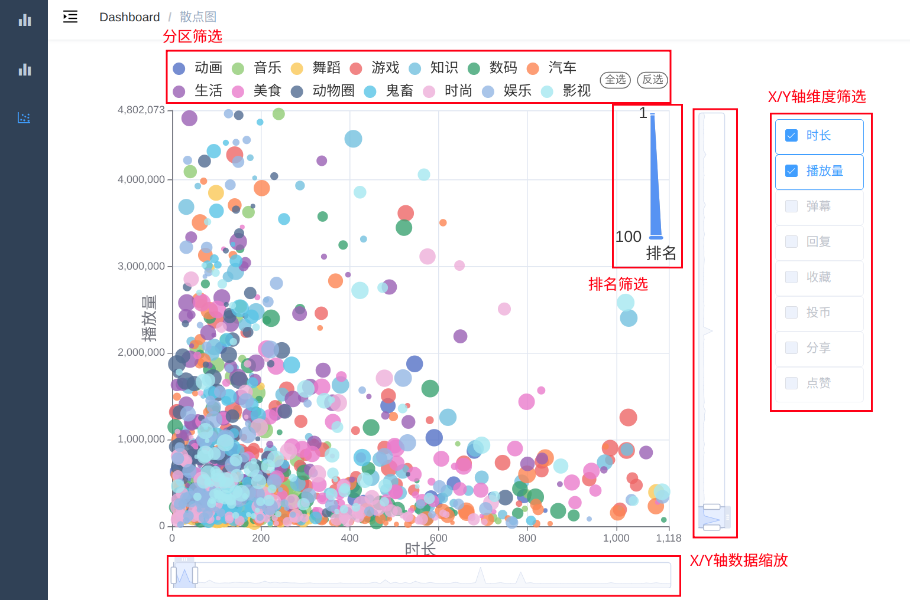
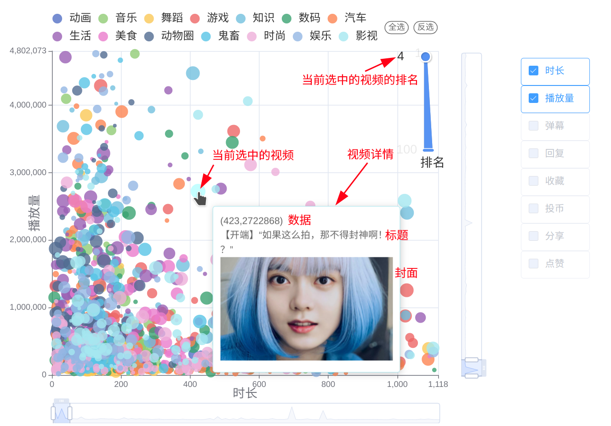

 # B站视频排行榜数据的可视化与交互

## 简介

本项目爬取了B站2022年1月18日-2022年2月18日[排行榜](https://www.bilibili.com/v/popular/rank)中14个分区的42,000个视频作为的播放量、弹幕量、评论量、硬币量、分享数、收藏数、点赞数等多个维度的视频数据。并使用Echarts将人机交互技术与数据可视化相结合，创新性地将这些高维数据数据绘制成含有时间轴的柱状图、多维度可筛选散点图等图表，用户可以通过人机交互技术筛选所关注的数据和维度并显示在图表中。通过这些图表可以挖掘出这些反映出用户对视频喜爱程度上的关联，不同分区中用户表现出的不同行为偏好等现象和规律，这些结果不仅能从一定程度上反映观众对于视频作品的审美偏好，对视频创作者来说也具有一定的指导价值。

## 展示

项目展示连接https://littleping-221.github.io/bilibili-data-visualization/

### 带有时间轴的总量柱状图

带有时间轴的总量柱状图功能如下

### 带有时间轴的归一化柱状图

带有时间轴的归一化柱状图功能如下

### 多维度可筛选散点图

多维度可筛选散点图功能如下

鼠标悬浮在某个数据点上会弹出该视频的详细信息，包括数据坐标、视频标题、视频封面、视频排名等，鼠标点击该数据点会自动跳转到 B 站的这条视频的页面。

## 技术实现

### 爬虫

爬虫首先请求各分区排行榜视频列表，虽然排行榜列表中也包含视频信息，但存在更新不及时的问题，所以通过排行榜得到的av号来单独请求每个视频的详细信息。请求单个视频的详细信息使用使用了[bilibili-api](https://github.com/MoyuScript/bilibili-api)。

爬虫代码在`crawler`文件夹中

### 可视化与交互

可视化页面使用了模板[vue-admin-template](https://github.com/PanJiaChen/vue-admin-template)，图表采用[Echarts](https://echarts.apache.org/)绘制。

3个主要图表的代码在`src/views`文件夹中

